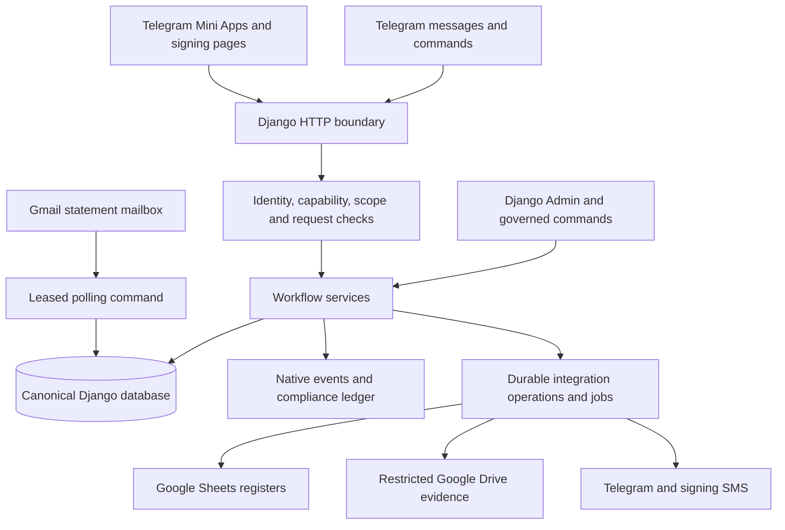
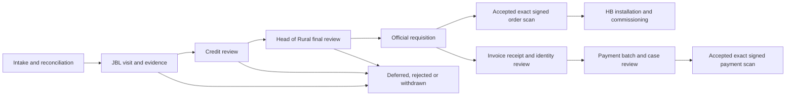

# Codebase assessment — 3 October 2026

## Scope and evidence

Runtime follow-up: [the Complaints, TAT and Portal depth review](miniapp-depth-review-2026-10-03.md)
records the subsequent Python/Playwright installation, fresh backend/browser
runs and focused reproductions. It supersedes this initial assessment's
unavailable-runtime verification limits; earlier source and historical-result
labels remain intentional.

This assessment describes the checked-out JBL/Jawabu HomeBiogas platform at
commit `092ead81c97b6195168a3293c6f2ddd9d1fa23ee`. The working tree was clean at
the start. It is based on current settings, routes, model definitions, service
implementations, tests, CI scripts, and indexed operational documentation.
Historical root summaries are not treated as evidence of current behavior.

The review maps all installed local apps and major workflow families, with
closer inspection of authentication, authorization, ingestion, transitions,
financial handling, evidence, publication, retry execution, and deployment.
It is a broad source review, not a claim that every line or execution path has
been exhaustively audited. No production database, customer files, live
integration, hosting configuration, or deployed migration state was inspected.
No application behavior, permission, schema, or external resource was changed.

Evidence labels used below:

- **Observed:** supported directly by inspected source or a check run here.
- **Recorded:** supported by repository verification records; not rerun here.
- **Inference:** an architectural consequence that needs measurement or a
  focused reproduction before being treated as an operational incident.

## What this system is

This is a Django modular monolith for field operations, lending workflow,
documents, approvals, complaints, and staff governance. Telegram is its main
staff identity and delivery channel. Django owns workflow state and audit
history. Sheets and Drive are operational publication and evidence systems.

The platform governs decisions and documents; the presence of a payment or
disbursement workflow does not establish that it executes a bank transfer.
Likewise, the credit-assessment module governs evidence and decisions; its
future automated analysis engine is dormant.

### Repository scale

Inventory was calculated from Git-tracked files. Model and test-method counts
use source declaration matching, not Django runtime introspection or test
discovery. Migration counts exclude `__init__.py`.

| Surface | Count |
|---|---:|
| Tracked files | 1,087 |
| Python files across the repository | 622 |
| Python files in the eight local apps | 590 |
| Local model declarations | 199 |
| Local migration files | 221 |
| `core/services` Python files, including `__init__.py` | 151 |
| Tracked HTML templates under template directories | 101 |
| `path()` declarations in `core/api/urls.py` | 302 |
| Local-app test files | 91 |
| Source-declared `test_…` methods in local apps | 2,121 |

| App | Models | Migrations | Main responsibility |
|---|---:|---:|---|
| `core` | 167 | 198 | Legacy domain models, identity, catalogues, complaints, Portal, TAT, SPIN, Origination, integrations and audit |
| `credit_assessments` | 12 | 3 | TAT appraisal evidence, mailbox receipts, analyst questions and decisions |
| `payments` | 8 | 4 | Payment numbering, invoice receipts, batch membership, case reviews and finality |
| `hb_operations` | 2 | 4 | Post-order installation, commissioning and events |
| `requisitions` | 2 | 2 | Official partner/group order sequences and sequence events |
| `portal_recognition` | 2 | 2 | Settled performance snapshots and temporary live standings |
| `tat_recognition` | 2 | 2 | Settled TAT recognition snapshots and temporary live standings |
| `qa_tracker` | 4 | 6 | Human test registry, release cycles, runs and private evidence |

Small extracted apps still depend on `core`. Some have their behavior and
tests in `core/services` and `core/tests_*`, so zero test files inside an app
does not prove that app is untested.

## Technical architecture

### Runtime and dependencies

The declared target is Python 3.12: `pyproject.toml` requires `>=3.12,<3.13`,
`runtime.txt` specifies 3.12.3, and CI uses Python 3.12. Django is pinned to
5.2.17. These are repository pins, not a statement about current upstream
versions or the runtime deployed in production.

Production delivery uses WSGI/Gunicorn. The start script supplies two threads
and a 120-second worker timeout; it does not explicitly configure a worker
count. Capacity therefore depends on the deployment environment and needs
measurement. PostgreSQL is the intended production database. SQLite remains
the settings fallback for local work. CI also uses a PostgreSQL 16 service.

Notable dependencies are Django Unfold for Admin, django-htmx, WhiteNoise,
gspread and Google API clients, psycopg, requests, openpyxl, Pillow, pypdf,
pypdfium2, ReportLab, WeasyPrint, cryptography, Africa's Talking and Sentry.
DRF is pinned, but the inspected workflow boundaries primarily use Django
function views and `JsonResponse`; its installation does not imply a uniform
DRF API architecture.

The frontend is Django-rendered HTML with workflow-specific JavaScript and
shared utilities. Production UI delivery has no required SPA build server.
Node tooling supports syntax, unit and browser checks. Optional UI libraries
are pinned and vendored, including HTMX, Leaflet, Lucide, Chart.js and AG Grid.
Avoid equating locally vendored assets with complete offline operation: APIs,
external evidence and map tiles still require connectivity.

### Boundaries and navigation

`config/urls.py` separates Admin, operations health, canonical `/api/` routes,
root browser/Mini App pages, and individually declared compatibility aliases.
`core/api/browser_urls.py` owns launch pages and Portal screens.
`core/api/legacy_urls.py` retains explicit provider and cached-client aliases.
This avoids exposing an entire API a second time at the root.

Views authenticate, authorize, parse, call services and format responses.
Services own most business rules. Models and migrations encode persistence
constraints. Management commands cover releases, diagnostics, reconciliation,
polling, retention and operational job execution.

These boundaries are useful but incomplete. `core/admin.py` is approximately
12,600 lines, `core/api/portal_views.py` 9,700, `core/models.py` 9,200 and
`core/api/views.py` 5,500. Line counts describe concentration, not correctness.
Large modules and lazy cross-imports raise review and change-impact costs.

## Functional map

### Complaints

Telegram/forwarded WhatsApp intake and Mini App creation produce canonical
complaints, human references, control state, events and evidence. New intake
requires identifying and descriptive fields; incomplete input is rejected.
Historical incomplete records can be completed through a governed action.

The UI presents Pending/Resolved semantics over retained legacy statuses.
Complaint Officers manage intake and permitted corrections/reopening.
Explicit Complaint `HB_STAFF` access governs resolution. Saved resolution
comments are append-only feedback and do not close a case. General Portal HB
authority does not automatically confer Complaint authority.

Global register/report surfaces use allowlisted projections and scoped
authorization. Category inference is advisory, uses governed category choices
and redaction, and is configured through off/shadow/suggest modes. Voice
transcription is separately configured. Neither feature replaces validation
or grants the model permission to change workflow state.

Main code: `core/services/complaint_cases.py`, `complaint_register.py`,
`complaint_imports.py`, `complaint_category_inference.py`,
`core/api/complaint_case_views.py`, and complaint test modules.

### Jawabu Portal, FarmUp, SysUp and FCA

Portal is a capability-scoped workspace over canonical cases, queues,
dashboard actions, case history, evidence, imports, invoices, documents,
payments and post-order work.

FarmUp organizes monthly worklists with versioned sources, mapping, validation,
repair and selective cumulative commit. Unselected rows stay held. SysUp is a
separate governed customer/system update source. FCA retains field review and
import behavior. Staging, canonical commit, publication and archival have
different states; Google failure does not mean a canonical commit failed.

Customer matching relies on exact normalized identifiers. Names are review
candidates, not an automatic identity join. Phone history and field provenance
support corrections. Household relationships preserve distinct legal people.

The principal pipeline is:

The diagram describes major gates, not every optional transition or a claim
that payment and installation have one universal ordering. Dedicated services
validate each action's prerequisites.

JBL visit completion combines required document captures, photos, field
validation and revision checks. Credit and final decisions have independent
authority. Deferral/rework routes retain history. Order assignment is gated
by prior decisions, rather than trusting client-provided stage values.

Main code: `jawabu_pipeline.py`, `portal_imports.py`,
`jawabu_customer_quality.py`, `jawabu_approvals.py`, `jbl_visit_documents.py`,
`portal_dashboard.py`, `portal_reporting.py`, and `core/api/portal_views.py`.

### Requisitions, invoices and payments

Official requisition numbers are allocated transactionally from group/partner
sequences. Generated workbook versions and signed scans bind to exact source
hashes. Drive publication does not define official finality.

Invoice processing accepts bounded PDF deliveries, persists source/checkpoint
identity, parses in a disposable worker, and reconciles invoices to cases.
Parsing or matching a PDF alone is insufficient to authorize payment.
Identity differences can produce a governed name-change process with versioned
letters and explicit corrected replacements. Only the designated canonical
source may change applicant identity.

Payment batches hold per-case `LOAN-JAWABU` or `CASH` modes. Head of Rural
reviews the payment facts for each case. Material changes invalidate reviews
or supersede generated workbooks. The official consecutive payment number is
allocated when a reviewed workbook is generated. An accepted exact signed
scan completes and locks the batch. Draft numbers/modes must not appear as
accepted payment instructions in Master Data.

Main code: `requisitions/models.py`, `payments/models.py`,
`payments/services.py`, `core/services/requisition.py`, `invoice_parser.py`,
`invoice_identity.py`, `payment_documents.py` and `document_signoffs.py`.

### HomeBiogas installation and commissioning

`hb_operations` is the post-order authority. Entry requires acceptance of the
exact official requisition scan. Installation and commissioning retain
separate facts and append-only events. Commissioning requires installation,
cannot predate it, and cannot use a future actual date.

The standard readiness interval is 21 days. Earlier commissioning requires an
explicit acknowledgement; it is not an unconditional 21-day prohibition.
Normal installation editing is restricted after commissioning, with governed
correction behavior preserving evidence.

Main code: `hb_operations/models.py`, `services.py`, `views.py` and `tests.py`.

### SPIN, TAT and credit assessment

Legacy SPIN captures credit/CRB requests, review and analyst completion with
attachment and identity requirements. Cutover behavior is feature-controlled.

TAT is a role-owned lending process and timing system. Cases retain selected
product version, stage configuration, requested amount and frozen loan-cycle
path. A later final loan amount does not silently change that path. Versioned,
legacy-assumed and unresolved configuration bindings are distinct; unresolved
cases are constrained until reconciliation.

Stages include statement handoff/verification, analysis, BRO response,
management/HOCC handling where applicable, sanctions, register approval and
finance disbursement. Paths and prerequisites vary by immutable configuration;
the legacy stage constants are not a universal current workflow definition.

TAT responsibilities route work and private notifications. AccessGrants
authorize it. Routing assignment alone cannot grant workflow access.
Official Nairobi business hours and holidays support timing calculations.

`credit_assessments` owns appraisal evidence and decisions linked to TAT.
Gmail ingestion tracks message/attachment identities and leased cursor state.
It matches statement metadata, retains encrypted statement passcodes, versions
evidence and analyst packages, captures questions/responses/validation, and
binds manager decisions to exact evidence. Polling is scheduled; no live
automated credit/CRB engine is established by the dormant `EngineJob` model.

Independent Pilot/Production switches snapshot mode at record creation.
Production records stay visible; Pilot reads also include the active Pilot
cycle. Closing a cycle makes old Pilot records read-only. Purge requires an
audited manifest and reviewed external readiness.

Main code: `spin_credit.py`, `tat_tracker.py`, `tat_configuration.py`,
`tat_responsibilities.py`, `tat_notifications.py`, `tat_reporting.py`,
`workflow_data_mode.py`, and `credit_assessments/`.

### Loan Origination

Origination is a configurable, product-neutral application and legal-document
workflow. Canonical field keys/types, immutable product schemas, commercial
terms and document mappings underpin captured applications.

Officers select one eligible Main LAF and optional supporting documents.
Applications and signing packages freeze the relevant schema, template,
mapping, evidence and signer snapshots. Commercial terms use Decimal quotes
and exact revision-bound exceptions.

Verified signing uses opaque sessions, consent, expiring/throttled OTPs and
exact packet hashes. Staff signer slots require the corresponding scoped
role. The test-signing simulator and production e-signing are separately gated.
Legacy packets retain pre-sign review; conditional packets require governed
consent and independent post-sign final approval. Corrections can invalidate
the affected signatures without pretending the old signed evidence never
existed. Archival is a further step with its own failure state.

Main code: `loan_origination.py`, `origination_document_catalogue.py`,
`origination_templates.py`, `origination_commercial_terms.py`,
`origination_esign.py`, `origination_consent.py`, `origination_final_review.py`
and `core/api/origination_views.py`.

### Staff governance, recognition and QA

Canonical Django users and UserProfiles anchor staff identity. Lifecycle plans
coordinate activation, access, transfers, leave, routing and offboarding.
Superusers can apply governed changes directly or submit them for independent
checker review. Hard deletion preserves compliance actor evidence and protects
the final active Superuser. Telegram activation and invitations are distinct
from Mini App authority.

Portal performance attributes accepted milestones to the officer who first
logs the JBL visit. Payment earns no milestone point. Settled snapshots and
temporary viewer rank checkpoints have different lifecycles. TAT recognition
likewise separates immutable final facts from expiring live standings; current
access still filters which facts a viewer may see.

QA tracker stores scoped human Pass/Fail/Blocked executions, cycles and
private screenshot evidence. It is separate from automated CI test execution.

## Cross-cutting data and security model

### Authority and isolation

The canonical Telegram verifier calculates HMAC-SHA256, compares hashes in
constant time, verifies payload shape and checks age. Authentication proves
Telegram identity. It does not itself grant business authority.

`user_access()` derives authority from active grants and eligible emergency
grants. Capability policy and branch/product/group scope are evaluated
together. `workflow_access.py` deliberately requires one complete grant tuple,
rather than combining a role from one grant with a branch from another.

An active Django Superuser is the explicit broad technical override. IT is a
business workflow role with mandatory capabilities but still requires a real
scoped grant. `is_staff` and Django Groups alone are not Mini App authority.

The webhook uses a configured secret and constant-time comparison. Manual
operator endpoints use token authorization. Public signer routes use opaque
session proofs and signing controls. CSRF-exempt routes therefore require
inspection by authentication family, not a blanket assumption that exemptions
are safe or unsafe.

Local/test authentication bypasses exist and are intended to be rejected by
production configuration checks. Correct production settings and correct
caller use of shared access helpers remain material dependencies.

### Transactions, retries and revision control

Important writes combine transactions, locked rows, revision checks,
request-key replay guards, and database uniqueness. These solve different
problems: a request key identifies a retry; a revision prevents an old screen
overwriting new work; a row lock serializes competing writes; a constraint
protects a durable invariant.

Shared request handling accepts bounded transport keys from headers/body and
rejects inconsistent headers. It avoids inventing a random server key that
would falsely appear to protect retries. Strict-mode readiness requires
production enforcement, although the setting's default is false.

The client retains ambiguous write identities and supplies request metadata.
This is useful retry protection, but presence of a transport key alone is not
proof that every domain mutation implements correct replay semantics.

### Audit and immutable evidence

Workflow-native events retain operational detail. The compliance ledger adds
deduplication, actor/authority attribution, chain position and hashes. Appends
lock a singleton chain row. Checkpoints and verification support investigation.

Hash chaining is tamper evidence, not a guarantee against a privileged actor
rewriting the entire database and chain. Independent retained checkpoints,
restricted database administration and tested restores matter. A singleton
append lock is also a potential throughput bottleneck, not a measured defect.

Document hashes bind decisions, signatures and scans to exact versions.
Historical identities and relationships must survive user offboarding or
deletion. Model-level immutability methods and service discipline must not be
assumed to protect every possible direct SQL or bulk ORM operation.

### Canonical identity, money and time

Canonical case UUIDs, customer identifiers and human references serve
different purposes. Current Master publication writes a short human reference
to visible `Case ID` and retains the exact UUID in hidden Master Record ID
metadata. Some comments/glossary text still describe the older visible UUID
contract. Matching and publication must follow implementation, not that wording.

Product identities and location codes are stable. Effective-dated product
versions and historical snapshots preserve the terms governing an existing
case. Aliases support old labels without making them new identities.

Financial model fields and product quote calculations use Decimal. Numeric
JSON/chart/Sheets/XLSX projections sometimes use floats, which is distinct from
using floats in canonical arithmetic. A legacy deposit parser does cross that
boundary earlier than desired; see the findings below.

Storage uses timezone-aware timestamps and `Africa/Nairobi` display/business
time. Business-calendar code defines weekday 08:00–17:00 hours and managed
holidays; hybrid timing means wall-clock and business-time metrics must not be
treated as interchangeable.

## Integration reliability and deployment

`IntegrationOperation` is a durable retry register. Operations have identity,
status, attempt count, deadlines and privacy-safe failure state. Shared
execution provides bounded attempts, circuit cooldown, rate-limit backoff,
row-locked claims and attempt tokens that fence stale completions.

Portal saves reserve Google publication separately. Destination-scoped FIFO,
shared pacing, composed call budgets and authoritative fresh reads avoid
publishing stale snapshots. A visible authenticated Portal client can pump
eligible work. Optional reviewed drain commands exist, but a closed client
population does not guarantee progress or a publication completion time.

Some older paths differ: `process_and_store_message()` can call Sheets inside
its database transaction unless publication is explicitly deferred. That can
hold database work open across a network call and introduces a remote/local
partial-failure boundary. The newer Portal pattern should not be assumed to
cover all legacy ingestion.

Complaint imports and TAT repairs have database-leased operational runners
and heartbeats. Gmail polling has its own lease and cursor. There is no
Celery/Redis requirement in the current design. Durable records survive a
process restart, but only an actual caller/runner advances them.

Invoice/PDF isolation is deliberate: source parsing has file/page/time budgets;
previews have source/page/pixel/output budgets. Windows has wall-time and pixel
controls; Linux additionally supports resource caps. Native dependencies and
real hosted memory behavior still need platform verification.

Deployment is split into build, release and start:

1. `build.sh` installs pins, preflights PDF rendering, checks Django/schema
   drift and collects static assets.
2. `release.sh` delegates to governed readiness, reviewed backup attribution,
   migration execution, post-checks, bootstrap and durable release evidence.
3. `start.sh` serves the reviewed release without running migrations or
   contacting Telegram.

Source-controlled release safeguards do not prove backups exist, a restore
drill passed, schedulers are configured, or the deployed release matches HEAD.

## Assessment of the quality attributes

| Attribute | Evidence and assessment | Remaining limit |
|---|---|---|
| Functionality | Broad operational coverage with separate approval and evidence gates | Live enabled features/configuration not inspected |
| Integrity | Revisions, locks, unique constraints, immutable snapshots and hash binding are substantial | Legacy ingestion and every write path still require focused assurance |
| Security | Central identity and scoped grant policy; technical overrides are explicit | Legacy username enrollment and route-governance gaps need review |
| Confidentiality | Protected evidence, governed secrets, redacted diagnostics and Sentry scrubbing | Invoice text logging remains an observed exception |
| Reliability | Durable jobs, checkpoints, bounded retry and stale-attempt fencing | Durable work has no guaranteed progress without an executor |
| Availability | Canonical Portal commits can succeed independently of Google | Hosting redundancy, uptime and failover are unverified |
| Recoverability | Versioned documents, historical events and release/backup attribution | No fresh backup/restore drill executed here |
| Auditability | Native history plus verifiable cross-workflow ledger | Coverage completeness and independent checkpoint custody unverified |
| Observability | Correlation IDs, timing, integration status, runner health and optional Sentry | Alert routing and hosted telemetry unverified |
| Performance | Bounded queues, indexes, query helpers, paging and render budgets | Some dashboard tasks are assembled before paging; no load profile |
| Scalability | PostgreSQL concurrency controls and destination-aware publication | Global chain/pacing locks, large read models and worker capacity need measurement |
| Maintainability | Many named services and emerging bounded apps | Legacy core concentration and cross-domain coupling remain high |
| Extensibility | Versioned catalogues, schema-driven forms and template contracts | New domains still encounter shared models and API/Admin modules |
| Testability | Extensive backend tests, Node checks, synthetic browser fixtures and PostgreSQL CI | Current backend/browser suites could not run in this shell |
| Usability | Mobile workflows, theme support, drafts, retry messages, scoped navigation and leave guards | Real Telegram keyboard, camera, back navigation and slow-network behavior need device testing |
| Accessibility | Some controls use ARIA, focus management and keyboard/navigation semantics | No comprehensive keyboard/screen-reader audit performed |
| Interoperability | Explicit Sheets ownership and protected Drive/Gmail/SMS integration contracts | Live credentials, quotas, sharing and separately deployed Apps Scripts unverified |
| Portability | Declared Linux/Python/PostgreSQL target with local Windows support | Native PDF libraries and different locally recorded versions complicate parity |
| Deployability | Build/release/start separation and readiness/audit evidence | Known CI blockers prevent a clean release assertion |
| Compliance readiness | Retention metadata, consent/evidence versions and actor preservation | These controls do not by themselves establish legal compliance |

## Findings and priorities

### 1. Expired dependency exception blocks CI — high, observed

`scripts/check_dependency_vulnerabilities.py` contains an exception expiring
30 September 2026. Its own `exception_errors()` rejects it after that date,
before running the dependency audit. On the review date, this is a definite
source-level CI blocker. The exception's description is historical metadata,
not fresh evidence of current advisory applicability or an available fix.

Next step: run a fresh dependency audit in the supported environment, assess
the actual dependency/input exposure, and resolve the package or obtain a
properly reviewed time-bounded decision. Do not silently extend the date.

### 2. Write-route inventory is behind route additions — high, observed candidates

The official checker is AST-based Python and could not run here. A narrower
source-matching cross-check found 28 unsafe-method route names absent from
the reviewed inventory/exclusion register. Examples include
`portal_publication_pump`, `portal_import_commit`,
`portal_farmer_case_correction`, `portal_invoice_receipt_batch_payment`,
`complaint_cases_complete_details`, `tat_tracker_task_read` and
`loan_origination_restart`.

These are inventory candidates, not proof that the routes lack runtime
authentication or replay protection. Recorded engineering notes also identify
the inventory as a CI blocker. The checker itself discovers only functions
defined under `core/api`; imported bounded-app views need explicit coverage.

Next step: rerun the official checker, review the complete route set including
imported views, and record real authentication, scope, transport identity and
domain replay behavior. Do not waive missing routes to make CI green.

### 3. Legacy ingestion deduplication omits group context — high, observed risk

`generate_message_hash()` hashes normalized sender/content/time window.
`process_and_store_message()` supplies those inputs without `group_id`.
`is_duplicate()` queries a globally unique `ProcessedMessage.message_hash`.
Thus identical sender/content/time inputs in different groups share a key.

This can suppress a legitimate second group's intake. It is a deterministic
source-level risk; no customer incident or database reproduction is claimed.
Group-aware Sheet routing later in the flow does not repair this distinction.

Next step: establish the intended cross-group replay policy and add a focused
two-group test before any key/constraint migration. Preserve existing retry
identity and migration compatibility.

### 4. Unparsed invoices can write document text into logs — high, observed

`_parse_invoice_pdf_bytes()` in `invoice_parser.py` logs up to 300 normalized
characters of an unparsed page. Document text can include customer identifiers
or financial facts. The general log configuration writes core logs to console
and a file. Sentry's separate scrubbing does not remove text already written
to those logs.

Next step: replace content previews with safe page/error/hash diagnostics and
review log access/retention. The existing engineering record also leaves invoice
diagnostic privacy unresolved. No sensitive document was opened for this review.

### 5. Full validation is not currently established — high, recorded

`KNOWN_GAPS.md` records a 94-test complaint PostgreSQL run with two failures
and a wider 192-test pipeline run with 25 failures and one error. It also
records scoped passing selections and browser checks. Those passing selections
do not establish a full-repository pass or current CI success.

Next step: reproduce failures on the same commit with Python 3.12/PostgreSQL
16, classify fixture/client-contract drift versus actual behavior defects, and
restore the required gates without weakening denial or integrity assertions.

### 6. Publication availability is executor-dependent — medium, observed

The browser pump stops when clients are not visible. Durable pending operations
remain recoverable but do not execute themselves. The runbook explicitly
provides no completion guarantee after all clients close.

Next step: define the required publication delay and monitor queue age. If
unattended completion is required, provide a governed scheduled executor rather
than assuming request-assisted processing meets that requirement.

### 7. Legacy monetary parsing is inconsistent with the Decimal rule — medium, observed

`clean_deposit_float()` parses legacy `actual_receipts` into `float`/`int`.
`requisition_deposit_values()` uses it when canonical deposit fields are
missing, and requisition/payment preparation consumes those values.

This differs from conversions made only when exporting Decimal values to
numeric XLSX/Sheets cells. It is a contract/precision seam, not evidence that
all financial calculations use floats or that a wrong payment occurred.

Next step: define a Decimal normalization and malformed/negative-value policy
for the fallback, then test affected legacy deposits and document output.

### 8. Database metadata enforcement misses installed app labels — medium, observed

The checked-in catalogue contains 195 models and explicitly excludes
`qa_tracker` from `CATALOGUE_APP_LABELS`; the four QA models explain the
difference from the 199-model source inventory.

`check_database_governance.py` filters additional metadata checks by
`BOUNDED_DOMAIN_APPS`, whose labels omit the currently installed extracted apps
such as `payments`, `requisitions`, `credit_assessments`, `hb_operations`, the
recognition apps and `qa_tracker`. Their models may have good metadata already,
but this filter does not enforce the full stated requirement on those apps.

Next step: clarify intentional catalogue exclusions and align checker coverage
with installed domain apps. Verify comments, retention, indexes and reverse
relations rather than treating catalogue counts alone as compliance evidence.

### 9. Legacy username-based initial binding deserves an enrollment review — medium, observed

`resolve_or_bind_telegram_user()` allows unbound legacy profiles without an
activation requirement/challenge to bind by Telegram username. Newly onboarded
profiles require single-use activation proof. Telegram usernames are mutable;
the security of the legacy path depends on the enrolled username still
belonging to the intended person at first binding.

Next step: inventory eligible unbound legacy profiles using privacy-safe
administration and determine whether they should receive explicit activation.
No account takeover or exploit is claimed, and changing effective identity
rules requires its own review and authorization.

### 10. Rejected raw-intake retention has a policy ambiguity — medium, observed

The raw-message invariant calls for auditable originals. The atomic complaint
rejection path rolls back `RawMessage`, `ProcessedMessage` and `ParsedMessage`;
tests explicitly assert zero rows after missing-ID rejection. Import batches
have separate source attribution, but that does not prove equivalent evidence
for every direct webhook rejection.

Next step: distinguish "no workflow case for rejected intake" from the policy
for minimal rejection evidence. Agree retention/privacy requirements before
introducing another persistence path. This is an intentional tested behavior
that conflicts with broad wording, not a reason to bypass intake validation.

### 11. Maintainability and performance seams need measured work — medium, inference

Large API/Admin/model modules, cross-domain imports and legacy paths increase
change risk. Dashboard/inbox data can be assembled in memory before pagination.
The compliance append lock and global integration pacing intentionally serialize
some work. These may constrain growth, but no throughput threshold is known.

Next step: measure realistic scoped queue sizes, SQL count/time, memory,
document processing and concurrent writes. Extract one bounded responsibility
at a time with existing routes and test contracts preserved.

### 12. Documentation has material historical drift — low/medium, observed

Root `ARCHITECTURE.md` describes an earlier parser/three-model system.
`AGENTS.md` also contains both the current bounded-app rule and an older
"add models to core" workflow recipe. Visible Case ID descriptions differ
from current publication code. These inconsistencies can misdirect future work.

Next step: reconcile the existing canonical guides with implementation and
mark historical documents explicitly. Do not make behavior changes simply to
match an older description.

## Verification performed in this session

| Check | Fresh result |
|---|---|
| Git working-tree status before analysis | Clean |
| Git-tracked source inventory | Completed |
| `npm.cmd run check:js` | Passed: 91 first-party JavaScript files |
| `npm.cmd run test:node` | Passed: all nine configured Node test groups |
| Syntax checks for all tracked Apps Script sources | Passed: seven `.gs` files, including nested scripts |
| Browser test discovery via `npm.cmd run test:browser -- --list` | Unavailable: Playwright executable/dependencies not installed |
| Python runtime discovery, including retry | Unavailable: `python`/`python3` resolve to Windows Store aliases; no usable `py`/`uv` found |
| Django tests, system checks, migration graph/drift, official governance checks | Not run: no usable Python runtime |
| Fresh dependency/advisory audit | Not run |
| PostgreSQL concurrency, schema upgrade and restore checks | Not run |
| Live Telegram, Google, Gmail, SMS and deployment checks | Not run |

The source-matching inventory cross-check is supplemental and does not replace
the official AST/Django checks. Syntax checks do not prove Apps Script behavior
in Google or require any external deployment.

## Practical next sequence

1. Establish a reproducible Python 3.12/PostgreSQL 16 verification environment
   and install the existing locked frontend test dependencies.
2. Restore dependency and route-inventory gates, then reproduce/classify the
   recorded backend failures on this exact commit.
3. Review the cross-group deduplication and invoice logging findings at their
   narrow boundaries; separately agree rejection-evidence and legacy-enrollment
   policy before changing them.
4. Align metadata enforcement and documentation with current app boundaries.
5. Measure capacity and set publication/runner/restore objectives with actual
   evidence. Perform live integration/device acceptance in an authorized
   isolated environment.
6. Continue incremental domain extraction after correctness and verification
   are stable. The current architecture does not justify an unrequested rewrite.

## Source anchors for follow-up

- Runtime/routing: `config/settings.py`, `config/urls.py`, `requirements.txt`,
  `pyproject.toml`, `runtime.txt`, `core/api/urls.py`, `browser_urls.py`,
  `legacy_urls.py`.
- Identity/authority: `core/services/telegram_identity.py`, `telegram_auth.py`,
  `workflow_access.py`, `workflow_capabilities.py`, `portal_permissions.py`,
  `access_control.py`, `staff_lifecycle.py`, `user_hard_delete.py`.
- Write/retry/audit: `miniapp_requests.py`, `workflow_transitions.py`,
  `external_resilience.py`, `portal_publication.py`, `compliance_audit.py`,
  `core/miniapp_write_inventory.py`, `core/sentry_monitoring.py`.
- Legacy intake: `deduplication.py`, `storage.py`, `core/api/views.py`,
  `core/tests.py` atomic complaint rejection tests.
- Financial/document controls: `product_quotes.py`, `requisition.py`,
  `invoice_parser.py`, `invoice_processing_limits.py`, `payment_documents.py`,
  `document_signoffs.py`, `payments/services.py`, `hb_operations/services.py`.
- Frontend: `core/static/miniapp/portal_api.js`, `runtime.js`, `utils.js`,
  `components.js`, `portal_case_navigation.js`, per-workflow assets/templates,
  `core/tests_js/`, `core/tests_browser/`, `playwright.config.js`.
- Verification/operations: `.github/workflows/ci.yml`, `scripts/check_*`,
  `scripts/audit_tracked_artifacts.py`, `core/services/database_catalog.py`,
  `build.sh`, `release.sh`, `start.sh`, `core/production.py`,
  `core/management/commands/release_production.py`, `KNOWN_GAPS.md`,
  `PRODUCTION_RUNBOOK.md`, and the indexed guides/ADRs under `docs/`.
